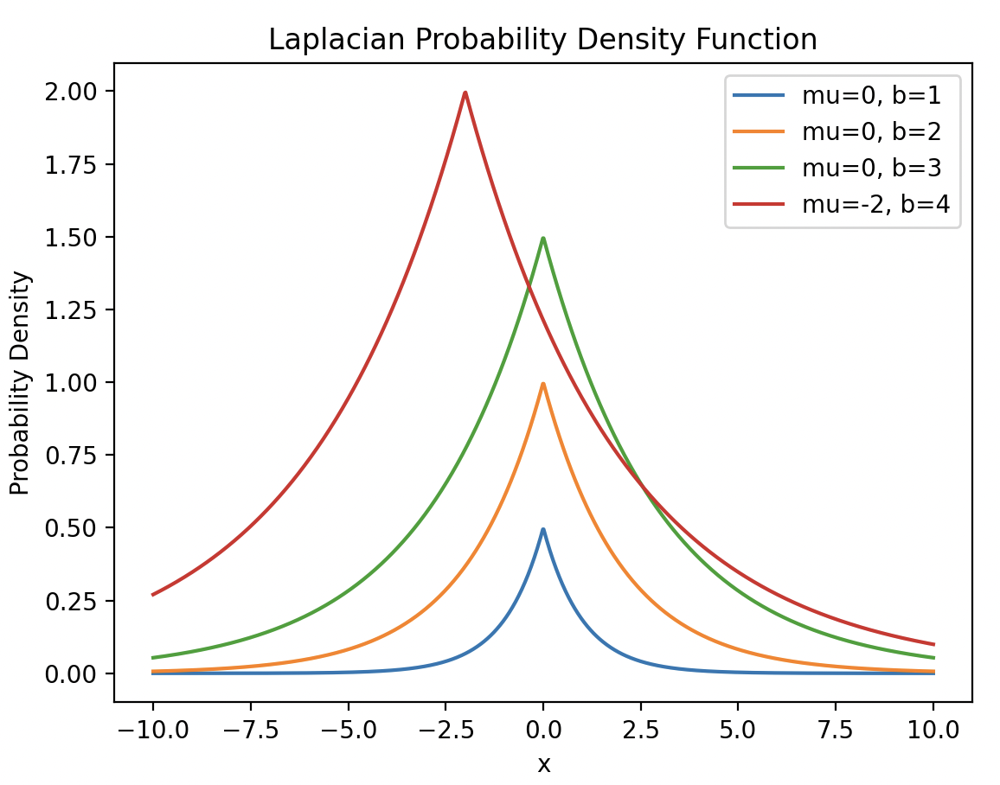

# 差分隐私的探索

## 引言

智能设备的广泛使用使数据呈指数增长，为机器学习模型发展提供了广阔空间。机器学习旨在从数据中提取有用信息，但训练数据常包含敏感信息，存在隐私泄露风险。例如，成员推理攻击等手段可从模型中获取隐私信息。隐私保护成为重要问题，各国已出台相关法律法规。

分布式机器学习成为物联网应用中的首选，联邦学习作为一种分布式学习范式，可在一定程度上保护数据隐私。然而，研究表明，联邦学习中上传的模型更新信息仍可能泄露敏感信息，需进一步隐私处理。传统隐私保护手段不适用于机器学习场景，而基于密码学的手段虽有效，但不利于模型训练。差分隐私作为一种隐私保护机制，可通过简单扰动保护隐私，同时保留数据统计特性，可与机器学习结合$`^{[1]}`$。

## 差分隐私概念

差分隐私并不是要求保证数据集的整体性的隐私, 而是对数据集中的每个个体的隐私提供保护。它的概念要求每一个单一元素在数据集中对输出的影响都是有限的。从而使得攻击者在观察查询结果后无法推断是哪一个个体在数据集中的影响使得查询返回这样的结果, 因此, 也就无法从查询结果中推断有关个体隐私的信息。换言之, 攻击者无法得知某一个个体是否存在于这样的一个数据集中$`^{[2]}`$。

------

**【差分隐私定义】**对于一个随机算法$`M`$，$`P_{m}`$为算法M可以输出的所有值的集合。如果对于任意的一对相邻数据集$`D`$和$`D'`$，$`P_{m}`$的任意子集$`S_{m}`$，算法M满足：

```math
Pr[M(D)\in S_{m}]\le e^{\epsilon}Pr[M(D')\in S_{m}]
```

则称算法M满足$`\epsilon-`$差分隐私，其中参数$`\epsilon`$为隐私保护预算（Pr表示概率），也可以在不等式左侧加上一个常数$`\delta `$，用于限制模型行为任意改变的概率。

若在图中呈现差分隐私的定义也许会更加直观（暂时没有找到合适的绘图软件，绘制较麻烦，先copy一下）


如图，$`D`$和$`D'`$是一对相邻数据集，通过算法M将其映射到某一个值域上，图中是这对相邻数据集的概率分布，当我们调整参数$`\epsilon`$时，可以改变这对相邻数据集在概率分布上的接近程度，$`\epsilon`$越接近0，两者越靠近，输出的结果越不可区分，隐私保护程度越高，但是数据的可用性越低，也就是说$`\epsilon`$越接近0，数据收集者越难分辨两组数据集，也就无法推敲某一组数据集的内容。

可能读者会疑惑，数据收集者是如何根据一组数据推出另一组数据的内容的，举一个简单例子：导员在收集班级上课考勤表的时候，发现一周内的逃课率高达20%（假设班内有100名学生），在某一节课导员突击检查，查询了99名同学，发现有19名同学逃课了，那么导员就可以推断出剩余的那名ricckker同学肯定是逃课了，~~原来ricckker同学逃课去写QG的作业了🤓👆~~，但是这并不重要，我们关注的是：ricckker同学的隐私暴露了，导员通过差分隐私技术，可以推断出个体的隐私。以上只是一个简单的例子，对于更加庞大的数据集和更复杂的分析算法，在现实生活中可能会导致更多重要数据的泄露。

## 差分隐私模型

Tips：接下来将会引入一大堆怪异的定义，大部分定义可能晦涩难懂，可以先阅读记忆定义内容，后面会对这些定义做出解释

差分隐私通过在查询结果上加噪声保护隐私，噪声量需平衡隐私与数据可用性。函数敏感度是关键参数。Dwork等人于2006年提出全局敏感度和拉普拉斯机制，利用全局敏感度控制噪声大小，实现满足差分隐私要求的保护机制。

**【全局敏感度定义】**对于一个查询函数f，它的形式为$`f:D\to R`$，其中D为一数据集，R是查询函数的返回结果。在一对任意的相邻数据集$`D`$和$`D'`$上，它的全局敏感度定义为：

```math
S(f)=\underset{D,D'}{max}\begin{Vmatrix}f(D)-f(D')\end{Vmatrix} _{1}
```

$`\begin{Vmatrix}f(D)-f(D')\end{Vmatrix} _{1}`$表示的是二者的范数/或称为曼哈顿距离；

全局敏感度代表的是在修改数据集中的**一条记录**时，查询函数输出的最大变化。通常全局敏感度只与查询函数相关，并且独立于数据集本身。对于某些查询函数，全局敏感度可能是无界的（例如三角形计数查询）或过大（例如中位数查询）。当全局敏感度较大或无界时，必须向输出中加入大量的噪声，因此会严重破坏数据的可用性。为了解决这个问题，Nissim等人提出了局部敏感度的思想。

**【局部敏感度定义】**对于一个查询函数f，它的形式为$`f:D\to R`$，其中D为一数据集，R是查询函数的返回结果。在一给定的数据集D和与它相邻的任意数据集$`D'`$上，它的局部敏感度为：

```math
LS_{f}(D)=\underset{D'}{max}\begin{Vmatrix}f(D)-f(D')\end{Vmatrix} _{1}
```

虽然局部敏感度缓解了全局敏感度在特殊情况下失效的问题，但也存在一定的安全隐患。根据定义2.4，局部敏感度是与具体数据集绑定的。当数据集 *D* 和 *D*′ 作为一对临近数据集时，对于某些查询函数，如果在两个数据集上的局部敏感度差异过大，就可以根据输出判断输入是 *D* 还是 *D*′。为了克服这一问题，Nissim等人继续提出了平滑敏感度的概念，通过平滑临近数据集的噪声尺度来解决这一问题。

**【平滑上界定义】**给定一个$`\beta>0`$，对于一个函数$`F:D\to R`$，在查询函数f上，如果它满足如下条件：

```math
\forall D:F(D)\ge LS_{f}(D)
```

```math
\forall D,D':F(D)\le e^{\beta}\times LS_{f}(D')
```

则称函数F是一个在查询函数f上的$`\beta-`$平滑上界。

**【平滑敏感度定义】**对于一个$`\beta>0`$，一个查询函数f的$`\beta-`$平滑敏感度为：

```math
S_{f}^{*}(D)=\underset{y\in D^{n}}{max}\{LS_{f}(y)\times e^{-\beta\times d(D,y)}\} 
```

其中, y 是和给定数据集 D 维度相同的任意数据集,函数 d 返回数据集 D 和 y 中的不同元素的个数。实际上, 平滑敏感度就是可以满足平滑上界条件的最小函数。有了敏感度的定义之后，各种差分隐私机制也被相继提出。作为最经典的差分隐私机制之一，拉普拉斯机制被广泛应用于各种隐私算法的设计之中。

------

### 拉普拉斯机制

拉普拉斯机制就是通过向查询结果中加入服从拉普拉斯分布的噪声来实现差分隐私保护。其概率密度函数为：

```math
p(x|\mu ,b)=\frac{1}{2} e^{-\frac{\left | x-\mu  \right | }{b} }
```

通过python代码我们可以看到不同参数对拉普拉斯概率密度函数的影响

```python
from matplotlib import pyplot as plt
import numpy as np

# 定义拉普拉斯概率密度函数
def laplacian_pdf(x, mu, b):
    return 0.5 * b * np.exp(-abs(x - mu) / b)

# 绘制不同参数的拉普拉斯概率密度函数
x = np.linspace(-10, 10, 1000)
plt.plot(x, laplacian_pdf(x, 0, 1), label='mu=0, b=1')
plt.plot(x, laplacian_pdf(x, 0, 2), label='mu=0, b=2')
plt.plot(x, laplacian_pdf(x, 0, 3), label='mu=0, b=3')
plt.plot(x, laplacian_pdf(x, -2, 4), label='mu=-2, b=4')

plt.xlabel('x')
plt.ylabel('Probability Density')
plt.title('Laplacian Probability Density Function')
plt.legend()
plt.show()
```

绘制得到的拉普拉斯概率密度函数如下图，我们可以看到$`\mu`$是函数的位置参数，而b是函数的尺度参数：



拉普拉斯机制的差分隐私保护定义为：对于给定数据集D，假设有函数$`f:D\to R^{d}`$，敏感度为$`\Delta f`$，随机算法$`M(D)=f(D)+Y`$，提供$`\epsilon-`$隐私保护，其中Y服从拉普拉斯分布：

```math
Y～Lap(\Delta f/\epsilon)
```

在前面我们已经介绍过，当$`\epsilon`$越小，也就是b越大，结合图像我们可以得知噪声更大，那也就是隐私保护程度越高，这样就完成了对前面描述的一个合理解释。值得注意的是，拉普拉斯机制只对数值型数据起作用。

------

至此，学习完前面的内容，我们可以总结一下，首先从差分隐私的定义出发，我们的目标是找到一个合适的算法M，让它满足一个不等式

```math
Pr[M(D)\in S_{m}]\le e^{\epsilon}Pr[M(D')\in S_{m}]
```

于是我们引入了拉普拉斯机制的概念，它设计了一个算法$`M(D)=f(D)+Y`$满足差分隐私的条件，其中的Y服从拉普拉斯分布，而为了求解Y，我们又层层递进，引入了平滑度的概念。综合上述，我们就实现了最初的目标，即：得到算法M。

------

### 指数机制

那么对于非数值型的数据集时，拉普拉斯机制似乎就不适用了，因此Mcsheey等人提出了<指数机制>，话不多说，先介绍指数机制的定义，后面再作解释：

**【指数机制定义】**设有随机算法M，输入为数据集D，输出阀值为Range，输出值为实体对象$`r\in Range`$，$`q（D，r）`$为可用性函数，$`\Delta q`$为可用性函数$`q（D，r）`$的敏感度，如果算法M正比于$`e^{\frac{\epsilon q(D,r)}{2\Delta q} }`$的概率从Range中选择并输出r，那么算法M提供$`\epsilon-`$差分隐私保护。

在指数机制中, 参数$`\epsilon`$越小, 每一项输出的概率就越接近，数据可用性越差；下面举一个具体的例子学习一下指数机制：

在一次公选活动中共有3名候选人以及10位选民，若攻击者控制了其余9民的选民（令他们给每位候选人各投3票）想知道选民A的投票，只需要知道最后的候选人投票结果，攻击者就可以知道选民A的具体投票；那么借助指数机制，选民A就可以抵御这次攻击，具体步骤如下：

1、定义可用性函数：定义可用性函数为每个候选人的得票数，$`q(D,r)`$表示在数据集D下，候选人r的得票数；

2、计算敏感度：根据前面介绍的定义，敏感度是可用性函数的最大变化量，在投票场景下，如果一个选民改变投票，最多会使某个候选人的票数变化1，即全局敏感度为$`\Delta \mu=1`$；

3、利用指数机制：对于每一个候选人r，被选中的概率P(r)与$`e^{\frac{\epsilon q(D,r)}{2\Delta q} }`$成正比；

4、具体实现：选民A可以选择一个合适的$`\epsilon`$值，正如前面所说，大的$`\epsilon`$准确率高，隐私保护若，小的反之；根据指数机制，A的投票结果会被随机化输出，即是攻击者控制了其余9名选民，也无法推断A的具体投票。

------

## 差分隐私在机器学习中的应用

在翻阅CSDN网站的时候看到一张很有趣的图，当然也是机器学习目前存在的隐私泄漏的问题：


这是一张有关于模型反向工程的图片，就是研究从模型反推至训练数据，我们知道：机器学习背后的本质实际上是通过大量数据调整模型参数以实现预测、判断的过程，但是训练所需的数据来源于真实生活，若被训练后的模型反向推出训练的数据，那么将会造成训练数据背后个体的隐私泄漏。

这时候差分隐私就起到了对数据保护的作用，我们为数据添加合适的噪音，在保证能够合格训练模型的同时对数据起到保护作用，下面我们通过pytorch设计一个模型，比对是否进行差分隐私处理对模型的影响程度：

```python
import gzip
import struct

import numpy as np
import torch
import torch.nn as nn
import torch.optim as optim
from opacus import PrivacyEngine
from torch.utils.data import Dataset, DataLoader
from torchvision import transforms


# 自定义 MNIST 数据集加载器，支持读取 .gz 文件
class MNISTDataset(Dataset):
    def __init__(self, images_path, labels_path, transform=None):
        with gzip.open(labels_path, 'rb') as lbpath:
            magic, n = struct.unpack('>II', lbpath.read(8))
            self.labels = np.frombuffer(lbpath.read(), dtype=np.uint8)

        with gzip.open(images_path, 'rb') as imgpath:
            magic, num, rows, cols = struct.unpack('>IIII', imgpath.read(16))
            self.images = np.frombuffer(imgpath.read(), dtype=np.uint8).reshape(len(self.labels), 28, 28)

        self.transform = transform

    def __len__(self):
        return len(self.labels)

    def __getitem__(self, idx):
        image = self.images[idx]
        label = self.labels[idx]
        if self.transform:
            image = self.transform(image)
        return image, label


# 定义简单的神经网络模型
class Net(nn.Module):
    def __init__(self):
        super(Net, self).__init__()
        self.fc1 = nn.Linear(28 * 28, 128)
        self.fc2 = nn.Linear(128, 10)
        self.relu = nn.ReLU()
        self.softmax = nn.LogSoftmax(dim=1)

    def forward(self, x):
        x = x.view(-1, 28 * 28)
        x = self.fc1(x)
        x = self.relu(x)
        x = self.fc2(x)
        x = self.softmax(x)
        return x


# 计算准确率的函数
def calculate_accuracy(model, data_loader):
    model.eval()
    correct = 0
    total = 0
    with torch.no_grad():
        for data, target in data_loader:
            output = model(data)
            _, predicted = torch.max(output.data, 1)
            total += target.size(0)
            correct += (predicted == target).sum().item()
    return correct / total


# 数据预处理
transform = transforms.Compose([
    transforms.ToTensor(),  # 将图像转换为 PyTorch 张量
    transforms.Normalize((0.1307,), (0.3081,))  # 归一化
])

# 加载本地 MNIST 数据集（.gz 文件）
train_dataset = MNISTDataset(
    images_path='./mnist_handwriting_data/train-images-idx3-ubyte.gz',
    labels_path='./mnist_handwriting_data/train-labels-idx1-ubyte.gz',
    transform=transform
)
test_dataset = MNISTDataset(
    images_path='./mnist_handwriting_data/t10k-images-idx3-ubyte.gz',
    labels_path='./mnist_handwriting_data/t10k-labels-idx1-ubyte.gz',
    transform=transform
)

train_loader = DataLoader(train_dataset, batch_size=64, shuffle=True)
test_loader = DataLoader(test_dataset, batch_size=1000, shuffle=False)

# 不使用差分隐私的模型
model_no_dp = Net()
criterion = nn.NLLLoss()
optimizer_no_dp = optim.SGD(model_no_dp.parameters(), lr=0.01)

# 训练不使用差分隐私的模型
for epoch in range(10):
    model_no_dp.train()
    running_loss = 0.0
    for i, (data, target) in enumerate(train_loader):
        optimizer_no_dp.zero_grad()
        output = model_no_dp(data)
        loss = criterion(output, target)
        loss.backward()
        optimizer_no_dp.step()
        running_loss += loss.item()
    print(f"Epoch {epoch + 1}, Loss: {running_loss / len(train_loader)}")

# 计算不使用差分隐私的模型的准确率
accuracy_no_dp = calculate_accuracy(model_no_dp, test_loader)
print(f"Accuracy without DP: {accuracy_no_dp:.4f}")

# 使用差分隐私的模型
model_dp = Net()
optimizer_dp = optim.SGD(model_dp.parameters(), lr=0.01)

# 使用 PrivacyEngine
privacy_engine = PrivacyEngine()
model_dp, optimizer_dp, train_loader_dp = privacy_engine.make_private(
    module=model_dp,
    optimizer=optimizer_dp,
    data_loader=train_loader,
    noise_multiplier=1.1,
    max_grad_norm=1.0,
)

# 训练使用差分隐私的模型
for epoch in range(10):
    model_dp.train()
    running_loss = 0.0
    for i, (data, target) in enumerate(train_loader_dp):
        optimizer_dp.zero_grad()
        output = model_dp(data)
        loss = criterion(output, target)
        loss.backward()
        optimizer_dp.step()
        running_loss += loss.item()
    # 获取隐私预算
    epsilon = privacy_engine.accountant.get_epsilon(delta=1e-5)
    print(f"Epoch {epoch + 1}, Loss: {running_loss / len(train_loader_dp)}, Epsilon: {epsilon:.2f}")

# 计算使用差分隐私的模型的准确率
accuracy_dp = calculate_accuracy(model_dp, test_loader)
print(f"Accuracy with DP: {accuracy_dp:.4f}")

```


> [1]辛邦洲.机器学习中的差分隐私应用技术研究[D].中国科学技术大学,2022.DOI:10.27517/d.cnki.gzkju.2022.000760.
>
> [2]李效光,李晖,李凤华,等.差分隐私综述[J].信息安全学报,2018,3(05):92-104.DOI:10.19363/J.cnki.cn10-1380/tn.2018.09.08.