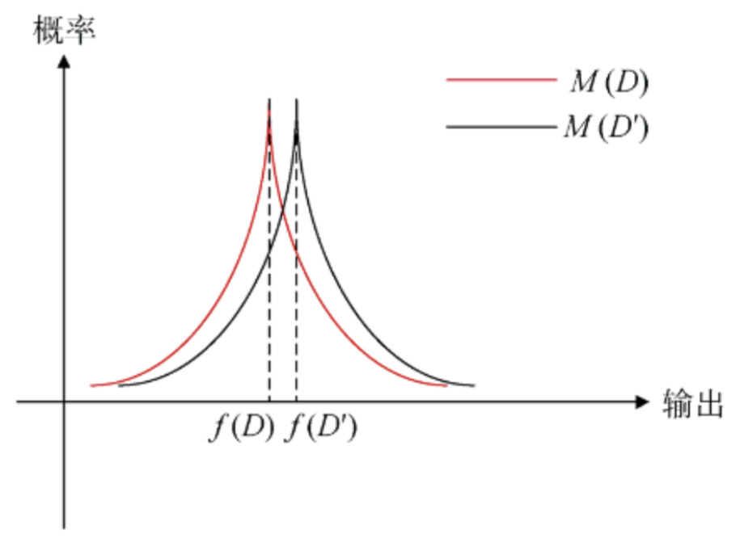

# 差分隐私的探索

## 引言

智能设备的广泛使用使数据呈指数增长，为机器学习模型发展提供了广阔空间。机器学习旨在从数据中提取有用信息，但训练数据常包含敏感信息，存在隐私泄露风险。例如，成员推理攻击等手段可从模型中获取隐私信息。隐私保护成为重要问题，各国已出台相关法律法规。

分布式机器学习成为物联网应用中的首选，联邦学习作为一种分布式学习范式，可在一定程度上保护数据隐私。然而，研究表明，联邦学习中上传的模型更新信息仍可能泄露敏感信息，需进一步隐私处理。传统隐私保护手段不适用于机器学习场景，而基于密码学的手段虽有效，但不利于模型训练。差分隐私作为一种隐私保护机制，可通过简单扰动保护隐私，同时保留数据统计特性，可与机器学习结合$`^{[1]}`$。

## 差分隐私概念

差分隐私并不是要求保证数据集的整体性的隐私, 而是对数据集中的每个个体的隐私提供保护。它的概念要求每一个单一元素在数据集中对输出的影响都是有限的。从而使得攻击者在观察查询结果后无法推断是哪一个个体在数据集中的影响使得查询返回这样的结果, 因此, 也就无法从查询结果中推断有关个体隐私的信息。换言之, 攻击者无法得知某一个个体是否存在于这样的一个数据集中$`^{[2]}`$。

------

**【差分隐私定义】**对于一个随机算法$`M`$，$`P_{m}`$为算法M可以输出的所有值的集合。如果对于任意的一对相邻数据集$`D`$和$`D'`$，$`P_{m}`$的任意子集$`S_{m}`$，算法M满足：

```math
Pr[M(D)\in S_{m}]\le e^{\epsilon}Pr[M(D')\in S_{m}]
```

则称算法M满足$`\epsilon-`$差分隐私，其中参数$`\epsilon`$为隐私保护预算（Pr表示概率），也可以在不等式左侧加上一个常数$`\delta `$，用于限制模型行为任意改变的概率。

若在图中呈现差分隐私的定义也许会更加直观（暂时没有找到合适的绘图软件，绘制较麻烦，先copy一下）



如图，$`D`$和$`D'`$是一对相邻数据集，通过算法M将其映射到某一个值域上，图中是这对相邻数据集的概率分布，当我们调整参数$`\epsilon`$时，可以改变这对相邻数据集在概率分布上的接近程度，$`\epsilon`$越接近0，两者越靠近，输出的结果越不可区分，隐私保护程度越高，但是数据的可用性越低，也就是说$`\epsilon`$越接近0，数据收集者越难分辨两组数据集，也就无法推敲某一组数据集的内容。

可能读者会疑惑，数据收集者是如何根据一组数据推出另一组数据的内容的，举一个简单例子：导员在收集班级上课考勤表的时候，发现一周内的逃课率高达20%（假设班内有100名学生），在某一节课导员突击检查，查询了99名同学，发现有19名同学逃课了，那么导员就可以推断出剩余的那名ricckker同学肯定是逃课了，~~原来ricckker同学逃课去写QG的作业了🤓👆~~，但是这并不重要，我们关注的是：ricckker同学的隐私暴露了，导员通过差分隐私技术，可以推断出个体的隐私。以上只是一个简单的例子，对于更加庞大的数据集和更复杂的分析算法，在现实生活中可能会导致更多重要数据的泄露。

> [1]辛邦洲.机器学习中的差分隐私应用技术研究[D].中国科学技术大学,2022.DOI:10.27517/d.cnki.gzkju.2022.000760.
>
> [2]李效光,李晖,李凤华,等.差分隐私综述[J].信息安全学报,2018,3(05):92-104.DOI:10.19363/J.cnki.cn10-1380/tn.2018.09.08.