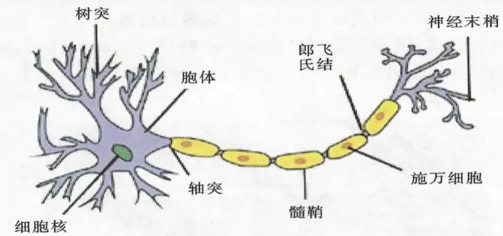
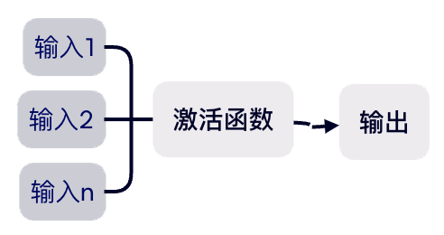
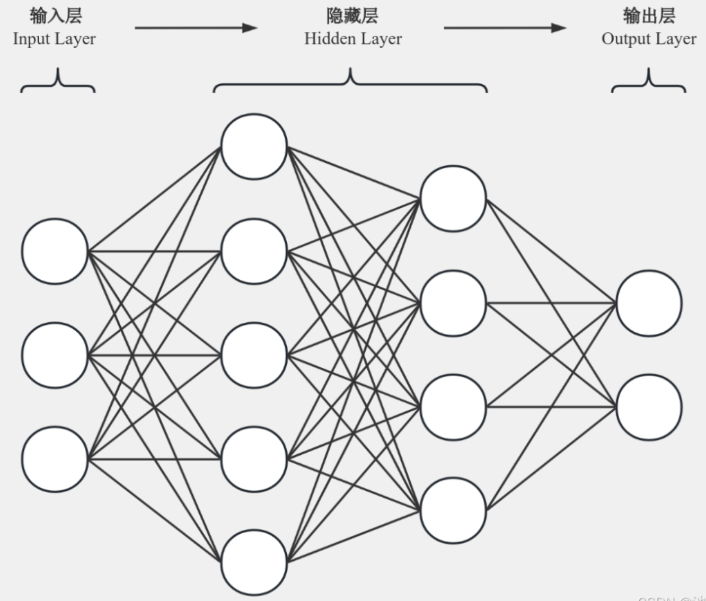

# 人工神经网络

## 引入

在正式介绍人工神经网络之前，我认为首先介绍一下生物神经元的结构是一个很不错的选择，这将是一个非常有趣的内容，也有助于我们后面更加形象的记忆人工神经网络的原理；



如图，这是一个生物神经元结构，由图中所示的各个部分构成，当我们的大脑在进行思考的时候，神经元会经历一系列复杂的生理和电生理过程，这些过程共同构成了大脑的信息处理和认知功能；当大脑接受外部刺激时，比如ricckker同学在思政课上写QG作业突然被老师一拍桌子，ricckker的神经元将会接受外部刺激，刺激转化为生物电信号，当某个神经元被激活时，信号通过突触传播至神经末梢，与其他神经元上的受体结合，从而引发下一个神经元的电位变化，于是，ricckker的大脑最终接收到了赶紧收起电脑的信号，完成了关电脑的操作；那么以上就是生物神经元的一个基本工作原理；我们可以看到树突、突触和神经末梢在信号传播的过程中起到了关键作用。

## 人工神经网络介绍

人工神经网络（Artificial Neural Networck ANN）作为机器学习的一个部分，是一种模仿生物神经网络的结构和功能的计算模型，它通过大量的简单处理单元（人工神经元）相互连接来实现信息处理和学习；根据前面对生物神经元的介绍，我们可以将其简化为一个简单的数学模型：



这是一个简单的人工神经元模型，也就是多个输入，通过激活函数得到一个输出，该神经元与其他神经元相连，将输出传递到下一个神经元作为输入，以此类推，于是多个神经元在一起便构建了层，多个层在一起便构建了一个人工神经网络（ANN）。那么，我们就可以通过代码实现一个最简单的ANN模型，我们先从基本单位神经元入手：

```python
class Neuron:
    def __init__(self):
        self.inputs = None  # 神经元的输入
        self.f = None       # 神经元激活函数
        self.output = None  # 神经元的输出

    def get_output(self):
        self.output = self.f(self.inputs)
        return self.output
    
```

在构建神经元的同时，我们定义了一个get_output方法用于计算神经元的输出，那么将多个神经元放在一起我们就得到了层：

```python
class Layer:
    def __init__(self, num_neurons, f):
        self.neurons = [Neuron() for _ in range(num_neurons)]
        self.f = f

    def get_outputs(self):
        return [neuron.get_output() for neuron in self.neurons]
```

将层与层相互连接，这样你就得到了一个人工神经网络！

```python
class Network:
    def __init__(self, layers):
        self.layers = layers

```

当然这只是一个最基础的模型，它似乎还不能完成任何工作，我们还需要对其进行研究和探索才能完善它。

## 人工神经网络结构

一般来说，人工神经网络共有三大部分组成，分别为：输入层，隐藏层和输出层；例如对于手写数字数据集，我们将手写数字转化为输入层的信号，信号在隐藏层中层层传播，最后到达输出层，输出最可能的数字，从这个例子我们可以知道，输入层和输出层只有一层，而隐藏层可以有很多层，数据从输入层逐层传播到输出层的过程我们称之为<前向传播>；我们可以把神经网络看作是一个黑箱，输入图片，经过一堆复杂的函数处理，最后输出一个数字表示图片代表的可能数字：


这就是人工神经网络做的工作，我们可以把它看作一个很复杂的函数，通过不同的训练，它就能对应的完成不同的功能；

