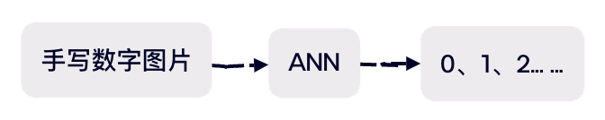

# 人工神经网络

Written by ricckker 2025/3/27 Guangdong·Guangzhou

## 引入

在正式介绍人工神经网络之前，我认为首先介绍一下生物神经元的结构是一个很不错的选择，这将是一个非常有趣的内容，也有助于我们后面更加形象的记忆人工神经网络的原理；


如图，这是一个生物神经元结构，由图中所示的各个部分构成，当我们的大脑在进行思考的时候，神经元会经历一系列复杂的生理和电生理过程，这些过程共同构成了大脑的信息处理和认知功能；当大脑接受外部刺激时，比如ricckker同学在思政课上写QG作业突然被老师一拍桌子，ricckker的神经元将会接受外部刺激，刺激转化为生物电信号，当某个神经元被激活时，信号通过突触传播至神经末梢，与其他神经元上的受体结合，从而引发下一个神经元的电位变化，于是，ricckker的大脑最终接收到了赶紧收起电脑的信号，完成了关电脑的操作；那么以上就是生物神经元的一个基本工作原理；我们可以看到树突、突触和神经末梢在信号传播的过程中起到了关键作用。

## 人工神经网络介绍

人工神经网络（Artificial Neural Networck ANN）作为机器学习的一个部分，是一种模仿生物神经网络的结构和功能的计算模型，它通过大量的简单处理单元（人工神经元）相互连接来实现信息处理和学习；根据前面对生物神经元的介绍，我们可以将其简化为一个简单的数学模型：


这是一个简单的人工神经元模型，也就是多个输入，通过激活函数得到一个输出，该神经元与其他神经元相连，将输出传递到下一个神经元作为输入，以此类推，于是多个神经元在一起便构建了层，多个层在一起便构建了一个人工神经网络（ANN）。那么，我们就可以通过代码实现一个最简单的ANN模型，我们先从基本单位神经元入手：

```python
class Neuron:
    def __init__(self):
        self.inputs = None  # 神经元的输入
        self.f = None       # 神经元激活函数
        self.output = None  # 神经元的输出

    def get_output(self):
        self.output = self.f(self.inputs)
        return self.output
    
```

在构建神经元的同时，我们定义了一个get_output方法用于计算神经元的输出，那么将多个神经元放在一起我们就得到了层：

```python
class Layer:
    def __init__(self, num_neurons, f):
        self.neurons = [Neuron() for _ in range(num_neurons)]
        self.f = f

    def get_outputs(self):
        return [neuron.get_output() for neuron in self.neurons]
```

将层与层相互连接，这样你就得到了一个人工神经网络！

```python
class Network:
    def __init__(self, layers):
        self.layers = layers

```

当然这只是一个最基础的模型，它似乎还不能完成任何工作，我们还需要对其进行研究和探索才能完善它。

## 人工神经网络结构

一般来说，人工神经网络共有三大部分组成，分别为：输入层，隐藏层和输出层；例如对于手写数字数据集，我们将手写数字转化为输入层的信号，信号在隐藏层中层层传播，最后到达输出层，输出最可能的数字，从这个例子我们可以知道，输入层和输出层只有一层，而隐藏层可以有很多层，数据从输入层逐层传播到输出层的过程我们称之为<前向传播>；我们可以把神经网络看作是一个黑箱，输入图片，经过一堆复杂的函数处理，最后输出一个数字表示图片代表的可能数字：



这就是人工神经网络做的工作，我们可以把它看作一个很复杂的函数，通过不同的训练，它就能对应的完成不同的功能；


## 神经元工作原理

前面稍微介绍了神经元的工作原理，这里我们详细介绍一下它的数学原理；

我们可以将神经元的每一个输入数据都转换成数字类型数据，这样就可以方便我们对其进行计算，对于每一个输入的数据，我们将其乘上对应的权重，最后将每一个数据相加，通过激活函数后输出；

【为什么要乘以权重】想象我们人脑对某一个手写数字进行识别的过程，我们之所以能区分不同的手写数字，因为他们在形状上有所差异，但是背后的记忆机制是如何的？我们通过判断数字形状的某些特征，例如数字“1”和“8”，在某一部分数字“8”所占的比例越高，所以当图片信号传入我们人脑时，它所对应的部分权重也就越高，最后神经网络输出8的机率也更高，有了权重，并在记忆中不断调整，这就是神经元是如何记忆某些数据的基本原理。

我们设神经元接受这样的一组输入：

```math
\mathbf{x}  =(x_{1},x_{2},...,x_{n})
```

对应的权重向量为：

```math
\mathbf{\omega }  =(\omega_{1},\omega_{2},...,\omega_{n})
```

将两组向量点乘，通过激活函数后得到神经元的输出：

```math
output=f(\mathbf{x·\omega } )=f(\sum_{i=1}^{n}x_{i}\omega _{i} )
```

`f`就表示神经元的激活函数。

## 激活函数

现在我们介绍几个常见的激活函数

【为什么要使用激活函数？】激活函数是一个非线性函数，能够使神经网络任意逼近任何非线性函数，若没有激活函数，那么无论神经网络有多少层，最终都只是输入数据的线性组合，这就退化到感知器模型了，处理能力自然就被弱化了。

### sigmoid函数

```math
f(x)=\frac{1}{1+e^{-x}}
```


以上就是sigmoid函数的数学表达式以及函数图像，我们可以发现，sigmoid函数的输出范围是0～1，非常适合表示某个事件的概率

### Tanh函数

```math
f(x)=\frac{e^{x}-e^{-x}}{e^{x}+e^{-x}}
```


tanh是一个关于原点对称的图形，输出的范围是-1～1，在实际应用中，tanh的效果会比sigmoid较好

### ReLU函数

```math
f(x)=max(0,x)
```


ReLU函数也是一个重要且常见的激活函数，它解决了梯度消失的问题，当输入值为正时，神经元不会饱和，具体效果可以在实际应用中有明显体现。

------

当然，人工神经元还有很多激活函数，以上介绍的只是其中最常见的，有关其他激活函数，有各自的优势和劣势，需要根据实际情境选择合适的激活函数，才能训练出一个较好的模型

## ANN工作机制

前面已经介绍了有关ANN的基础知识，接下来我们看看人工神经网络是如何被训练的；类似于人脑的记忆机制，例如针对我们在识字时，需要通过反复记忆、学习我们就记住了这个字，当我们看到某个字时，人脑的神经网络开始工作，但是记忆机制有别于前面所介绍的前向传播，我们是在知道字是什么字的前提下对其进行记忆，或者换句话说，这是一个被打上标签的数据，我们最终记忆了数据与该标签是相对应的，这时就要引入<反向传播>的概念了，神经网络通过反向传播，逐步调整每一层神经元的权重，使得该数据在前向传播时能够正确输出对应的标签。

### 反向传播算法(BP算法)

调整神经网络的权重主要依靠反向传播算法实现，反向传播算法也称为“误差反向传播”算法，是适合于多层神经网络的一种学习算法，它建立在梯度下降法的基础上，梯度下降法通过计算损失函数的梯度，并将梯度反馈给最优化函数来更新权重以最小化损失函数。

首先我们介绍网络的误差，定义输出误差信号为：

```math
e_{j}=d_{j}(n)-y_{j}(n)
```

其中神经元`j`是输出节点，定义神经元`j`的损失函数：

```math
E(n)=\frac{1}{2}\sum_{j\in C}^{} e_{j}^{2}(n)
```

集合`C`包括网络输出层的所有神经元，对所有n求和，我们可以得到网络的均方误差(MSE)：

```math
E_{av}=\frac{1}{N}\sum_{n=1}^{N}E(n)
```

训练模型的目的就是通过调整网络中每个神经元的权重参数最小化这个损失函数，类似于多元线性回归求解参数的过程，对于神经元的参数更新，我们同样使用梯度下降法：

```math
\omega_{k+1}=\omega_{k}-\alpha·grad
```

```math
记神经元j在迭代n次输出的函数信号为y_{j}(n)=f(\sum_{i=0}^{m}\omega_{jk}(n)y_{i}(n))
```

其中，$`\omega_{jk}`$表示权重，$`y_{i}`$表示上一层的输出，`f`表示激活函数

```math
grad=\frac{\partial E(n)}{\partial \omega_{jk}(n)}=\frac{\partial E(n)}{\partial e_{j}(n)}·\frac{\partial e_{j}(n)}{\partial y_{j}(n)} ·\frac{\partial y_{j}(n)}{\partial v_{j}(n)}·\frac{\partial v_{j}(n)}{\partial \omega_{jk}(n)} 
```

我们逐一求解式子中的每一项：

```math
\frac{\partial E(n)}{\partial e_{j}(n)}=e_{j}(n)
```

```math
\frac{\partial e_{j}(n)}{\partial y_{j}(n)}=\frac{\partial (d_{j}(n)-y_{j}(n))}{\partial y_{j}(n)}=-1
```

```math
\frac{\partial y_{j}(n)}{\partial v_{j}(n)}=f'_{j}(\sum_{i=0}^{m}\omega_{jk}(n)y_{i}(n))
```

```math
\frac{\partial v_{j}(n)}{\partial \omega_{jk}(n)} =\frac{\partial \sum_{i=0}^{m}\omega_{jk}(n)y_{i}(n)}{\partial \omega_{jk}(n)}=y_{i}(n)
```

```math
grad=-e_{j}(n)f'_{j}(\sum_{i=0}^{m}\omega_{jk}(n)y_{i}(n))y_{i}(n)
```

```math
令\delta _{j}(n)=-\frac{\partial E}{\partial v_{j}(n)}=-e_{j}(n)f'_{j}(\sum_{i=0}^{m}\omega_{jk}(n)y_{i}(n)) 
```

```math
则grad=\alpha·\delta _{j}(n)·y_{j}(n)
```

以上是对输出层的权重修正公式，下面来推导隐藏层的梯度下降公式：

当神经元`j`位于隐藏层时，没有期望的输出，我们就要修改公式：

```math
\delta _{j}(n)=-\frac{\partial E}{\partial y_{j}(n)}·\frac{\partial y_{j}(n)}{\partial v_{j}(n)} =-\frac{\partial E}{\partial y_{j}(n)}f'_{j}(\sum_{i=0}^{m}\omega_{jk}(n)y_{i}(n))
```

```math
\frac{\partial E}{\partial y_{j}(n)}=\frac{1}{2}·\frac{\sum_{k\in C}^{} e_{k}^{2}(n)}{\partial y_{j}(n)}=\sum_{k}^{}e_{k}(n)\frac{\partial e_{k}(n)}{\partial y_{j}(n)}=\sum_{k}^{}e_{k}(n)\frac{\partial e_{k}(n)}{\partial v_{k}(n)} ·\frac{\partial v_{k}(n)}{\partial y_{j}(n)} 
```

```math
=-\sum_{k} e_{k}(n)f'(\sum_{i=0}^{m}\omega_{jk}(n)y_{i}(n))w_{kj}(n)=-\sum _{k}\delta_{k}(n)w_{kj}(n)
```

```math
于是\delta _{j}(n)=f'(\sum_{i=0}^{m}\omega_{jk}(n)y_{i}(n))\sum _{k}\delta _{k}(n)w_{kj}(n)
```

## 理论存在，实践开始

接下来我们用代码实现人工神经网络的模型训练，我们可能需要重新定义神经元，实现更加高效的操作

首先导入必要的库和定义必要的函数

```python
import numpy as np
from matplotlib import pyplot as plt

def sigmoid(x):
    return 1 / (1 + np.exp(-x))

def sigmoid_derivative(x):
    return x * (1 - x)

def relu(x):
    return np.maximum(0, x)

def relu_derivative(x):
    return 1. * (x > 0)

def tanh(x):
    return np.tanh(x)

def tanh_derivative(x):
    return 1 - np.tanh(x) ** 2
```

重新定义神经元

```python
class Neuron:
    def __init__(self, weights, f):
        self.inputs = None  # 用于存储输入值
        self.weights = weights
        self.output = 0
        self.delta = 0  # 用于存储误差反向传播时的梯度
        self.f = f  # 激活函数

    def forward(self, inputs):
        self.inputs = inputs
        self.output = self.f(np.dot(inputs, self.weights))
        return self.output
```

构建层：

```python
class Layer:
    def __init__(self, num_inputs, num_neurons, f):
        self.neurons = [Neuron(np.random.uniform(-1, 1, num_inputs), f) for _ in range(num_neurons)]
        self.output = []
        self.delta = []  # 用于存储这一层的误差

    def forward(self, inputs):
        self.output = np.array([neuron.forward(inputs) for neuron in self.neurons])
        return self.output
```

构建ANN网络：

```python
class ANN:
    def __init__(self, layers):
        self.layers = layers

    def forward(self, inputs):
        for layer in self.layers:
            inputs = layer.forward(inputs)
        return inputs
```

上面的代码实现都相对容易，下面重点来看反向传播backward的算法，针对输出层和隐藏层，我们需要设计不同的算法实现不同的$`\delta`$计算，代码变量较多有点绕，需要仔细思考、认真观察代码！

```python
    def backward(self, expected, learning_rate):
        for i in reversed(range(len(self.layers))):
            layer = self.layers[i]
            
            # 输出层delta计算
            if i == len(self.layers) - 1:
                for j in range(len(layer.neurons)):
                    neuron = layer.neurons[j]
                    neuron.delta = (expected[j] - neuron.output) * sigmoid_derivative(neuron.output)
            
            # 隐藏层delta计算
            else:
                for j in range(len(layer.neurons)):
                    neuron = layer.neurons[j]
                    neuron.delta = 0
                    for k in range(len(self.layers[i + 1].neurons)):
                        neuron.delta += self.layers[i + 1].neurons[k].delta * self.layers[i + 1].neurons[k].weights[j]
                    neuron.delta *= sigmoid_derivative(neuron.output)
            
            # 更新权重
            for j in range(len(layer.neurons)):
                neuron = layer.neurons[j]
                for k in range(len(neuron.weights)):
                    neuron.weights[k] += learning_rate * neuron.delta * neuron.inputs[k]
```

模型训练代码：

```python
    def train(self, inputs, expected, learning_rate, epochs):
        loss_history = []
        for epoch in range(epochs):
            loss = 0
            for i in range(len(inputs)):
                self.forward(inputs[i])
                self.backward(expected[i], learning_rate)
                loss += np.mean((expected[i] - self.layers[-1].output) ** 2)
            
            loss /= len(inputs)
            loss_history.append(loss)
            
            if (epoch + 1) % 100 == 0:
                print(f'Epoch {epoch + 1}/{epochs}, Loss: {loss}')

        return loss_history
```

至此，我们就完成了一个基础ANN的构建，它可以用于训练并完成某些数据的预测、判断，我们以经典的异或分类为例，测试一下这个网络：

```python
if __name__ == '__main__':
    # 预测简单的线性模型
    # 生成训练数据
    x = np.linspace(0, 1, 100)
    y = x + np.random.normal(0, 0.1, 100)

    inputs = x.reshape(-1, 1)
    expected = y.reshape(-1, 1)

    ann = ANN([Layer(1, 10, sigmoid), Layer(10, 5, sigmoid), Layer(5, 1, sigmoid)])
    loss_history = ann.train(inputs, expected, 0.1, 1000)

    # 绘制损失和预测图像，拼在一起
    plt.figure(figsize=(10, 5))
    plt.subplot(1, 2, 1)
    plt.plot(loss_history)
    plt.xlabel('Epoch')
    plt.ylabel('Loss')
    plt.title('Loss History')

    plt.subplot(1, 2, 2)
    plt.scatter(x, y, color='blue', label='Data')
    ann_outputs = []
    for i in range(len(inputs)):
        ann_outputs.append(ann.forward(inputs[i]))
    ann_outputs = np.array(ann_outputs)
    plt.plot(x, ann_outputs, color='red', label='Prediction')
    plt.xlabel('x')
    plt.ylabel('y')
    plt.title('Prediction')
    plt.legend()
    plt.show()
```

具体输出可以看Jupyter的输出了，看下面的图片也可以，加载可能比较慢[实验结果](./06_ANN实验结果.ipynb)


