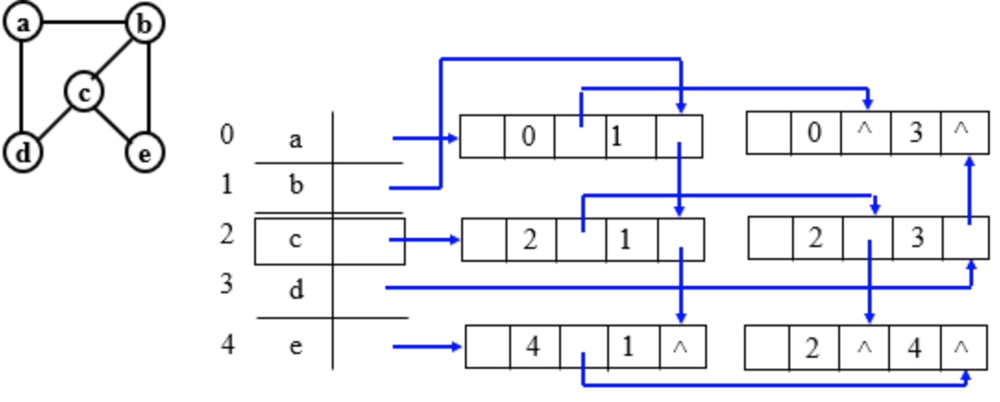

# 多智能体与图论的探索

*——"亲爱的，你是我生命中的最美顶点，与你相遇，我的世界便形成了最完美的连通图。"*

tips：GitHub上预览本篇文章可能较不美观，若需要更好阅读体验，建议下载阅读！

[TOC]

## 图论基础学习

### 图的介绍

**🫵什么是图？美国网友ChatGPT如是说：**

从计算机学角度来说，图就是一个由点（节点）和线（边）组成的结构，用来表示不同对象之间的关系。

- **节点**就像一个个独立的“事物”，比如人、地点、设备等。
- **边**表示节点之间的联系，比如朋友关系、道路连接等。

图可以用来存储和处理复杂的关系网络，比如社交网络中的人际关系、地图上的交通网络，或者计算机网络中的设备连接。通过图，我们可以方便地分析和解决问题，比如查找最短路径、推荐朋友等。

------


### 图·初探——图的定义

😠话不多说，既然是图，直接上图：


观察这样一个简单的图我们可以引入关于图的两个简单名词：

**【顶点vertex】**如上图，图中的A、B、C、D、E五个点，我们都可以将其称为图的***<u>顶点</u>***，我们也可以将其称为图的节点/结点，它是图的基本元素之一；

**【边edge】**如上图，将图中的顶点连接在一起的连接线，我们将其称为图的***<u>边</u>***，我们也可以将其称为图的弧/线；

以上两个即是构成图的两个基本元素，由此，我们很自然的学习了图的定义：在数学和计算机科学中，图是由顶点和边组成的数据结构，用于描述对象之间的关系。

------


### 婀娜多姿的图——图的分类

既然了解了什么是图，那么在图上稍作变化，我们就可以得到以下几类图：

#### 无向图

实际上，在上面介绍图的时候所给的例子就是一个简单的无向图


若顶点$`V_{i}`$到$`V_{j}`$之间的边没有方向，则称这条边为无向边（Edge），用无序偶对$`(V_{i}, V_{j})`$来表示。如果图中任意两个顶点之间的边都是无向边，则称该图为无向图（Undirected Graphs）;

#### 有向图


若从顶点$`V_{i}`$到 $`V_{j}`$的边有方向，则称这条边为有向边，也称为弧（Arc）。一般采用尖括号括起来表示，例如$`<V_{i}, V_{j}>`$。前者$`V_{i}`$称为弧尾（Tail），后者$`V_{j}`$称为弧头（Head）。如果图中任意两个顶点之间的边都是有向边，则称该图为有向图（Directed graphs）;

#### 加权图


在加权图中每条边都有相应的权重，称为边权值，它可以用来表示结点之间的距离或者两结点“走动”的代价，加权图又被称为网络；

------


### 图的基本术语

😴该部分较为枯燥无趣，就copy一下相关的介绍

**【邻接】**若（V1，V2）是图中的一条边，则称顶点V1和V2是相邻接（Adjacent）的顶点，称边（V1，V2）是依附于顶点V1和V2的边；

**【路径】**顶点Vi到顶点Vj之间的连线称为路径（Path）；

**【简单路径】**在一条路径中，如果除了第一个顶点和最后一个顶点外，其余顶点各不相同，则称这样的路径为简单路径；

**【回路（环）】**若一条路径的起点和终点相同（即Vi=Vj），则称此路径为**回路**或者**环**；

**【简单回路（简单环）】**在一个图的序列中除过第一个顶点与最后一个顶点之外，其他顶点不重复出现的回路称为简单回路或者简单环；

**【顶点的度】**

顶点的**度**是指依附于某顶点Vi的边数，通常记为TD(Vi)；
顶点的**入度**（InDegree）是指以Vi为终点的弧的而数目，记为ID(Vi)；
顶点的**出度**（OutDegree）是指以Vi为始点的弧的数目，记为OD(Vi)；
于是有：TD(Vi) = ID(Vi)+OD(Vi)

**【连通】**若从顶点Vi到顶点Vj（ i ≠ j ）有路径，则Vi和Vj是连通的；

**【连通图】**在无向图中，任意两个顶点Vi和Vj都是联通的则称这样的无向图为连通图；

**【强连通图】**在有向图中，任意一对顶点Vi和Vj（ i ≠ j ）均有从Vi到Vj和从Vj到Vi的有向路径，则称为强连通图。

------


### 图的存储结构

🧐ricckker作为一名合格的计算机专业学生，必须要了解图背后的存储结构，在仔细查阅资料后总结出以下几点：

#### 邻接矩阵（Adjacency Matrix）

由于图是由顶点和边两部分组成的，其中，顶点不区分大小、主次关系，所以可以将图的顶点存储到一个一维数组中，边是两个顶点之间的关系，用邻接矩阵存储，来表示各顶点之间的邻接关系，邻接矩阵的元素可以表示为：

```math
arc[i][j]=\left\{\begin{matrix}0,(v_{i},v_{j})\notin E或i=j\\1,(v_{i},v_{j})\in E\end{matrix}\right.
```

我们用最初介绍的图来进行实战，将下图转为邻接矩阵即为：


```math
G=\begin{bmatrix}
 0 & 1 & 1 & 0 & 0\\
 1 & 0 & 1 & 0 & 1\\
 1 & 1 & 0 & 1 & 0\\
 0 & 0 & 1 & 0 & 1\\
 0 & 1 & 0 & 1 &0
\end{bmatrix}
```

ricckker在打矩阵公式的时候发现邻接矩阵具有以下几点性质：

1、无向图的邻接矩阵是对角线对称的；

2、第$`i`$个顶点的度=邻接矩阵第$`i`$行中1的个数；

3、图的边数=所有非0元素之和/2

------

上面是关于最简单的无向图的邻接矩阵，那么有向图应该如何表示？有向图的邻接矩阵可以表示如下：

第i行：以结点$`v_{i}`$为起点的边（出度边）；第i列，以结点$`v_{i}`$为终点的边（入度边），我们借助上面的图进行一个简单的实战。


将该有向图转换为邻接矩阵即是：

```math
G=\begin{bmatrix}
 0 & 0 & 1 & 0 & 0\\
 1 & 0 & 1 & 1 & 0\\
 0 & 0 & 0 & 0 & 1\\
 0 & 0 & 0 & 0 & 0\\
 0 & 0 & 0 & 0 & 0
\end{bmatrix}
```

关于有向图的邻接矩阵，具有以下几点性质：

1、第i个顶点的出度=第i行元素之和

2、第i个顶点的入度=第i列元素之和

3、第i个顶点的度=第i行元素之和+第i列元素之和

------

同样的，有权图（网）也可以用邻接矩阵表示，矩阵元素规则如下：

```math
Edge[i][j]=\left\{\begin{matrix}
 W_{ij},<v_{i},v_{j}>\in E\\
\infty ,无边或i=j
\end{matrix}\right.
```

根据该规则，我们将前面的例子改写成邻接矩阵：


```math
Edge=\begin{bmatrix}
 \infty & \infty & 220 & \infty & \infty\\
 100 & \infty & \infty & \infty & 80 \\
 \infty & 200 & \infty & 150 & \infty\\
 \infty & \infty & \infty & 180 & \infty\\
 \infty & \infty & \infty & \infty & \infty
\end{bmatrix}
```

------

当然，ricckker作为一名合格的程序员，不仅需要知道其存储结构，同时需要用代码将该结构表示出来，当然，有了前面的理论铺垫，代码的实现也相对容易，下面以加权图为例编写代码：

```c++
#include <iostream>
#include <vector>
#include <climits>

using namespace std;

// 构建加权图的邻接矩阵
void buildWeightedGraph(int vertices, int edges, vector<vector<int>>& adjMatrix) {
    for (int i = 0; i < vertices; ++i) {
        for (int j = 0; j < vertices; ++j) {
            adjMatrix[i][j] = (i == j) ? 0 : INT_MAX;
        }
    }

    cout << "请输入每条边的起点、终点和权重（用空格分隔）：" << endl;
    for (int i = 0; i < edges; ++i) {
        int start, end, weight;
        cin >> start >> end >> weight;

        if (start < 0 || start >= vertices || end < 0 || end >= vertices) {
            cout << "输入的顶点编号无效，请重新输入！" << endl;
            --i;
            continue;
        }
        adjMatrix[start][end] = weight;
    }
}

// 打印邻接矩阵
void printAdjMatrix(const vector<vector<int>>& adjMatrix) {
    int vertices = adjMatrix.size();
    cout << "加权图的邻接矩阵为：" << endl;
    for (int i = 0; i < vertices; ++i) {
        for (int j = 0; j < vertices; ++j) {
            if (adjMatrix[i][j] == INT_MAX) {
                cout << "INF ";
            } else {
                cout << adjMatrix[i][j] << " ";
            }
        }
        cout << endl;
    }
}

int main() {
    int vertices, edges;
    cout << "请输入顶点数："; cin >> vertices;
    cout << "请输入边数："; cin >> edges;

    vector<vector<int>> adjMatrix(vertices, vector<int>(vertices));			// 创建邻接矩阵
    buildWeightedGraph(vertices, edges, adjMatrix);			// 构建加权图的邻接矩阵
    printAdjMatrix(adjMatrix);			// 打印邻接矩阵

    return 0;
}
```

------


#### 邻接表（链式）表示法（Adjacency List）

简单来说，邻接表法就是只存储图中顶点的边，对每个顶点都建立一个链表，将与该顶点相连的边存入该链表中，这样的一个链表对应着前面所讲的邻接矩阵的一行，那么同样的，还是以最初的无向图为例，我们可以画出它的链表结构


链表的每个节点对应图中的顶点，可以在链表顶点中存储顶点的信息，用链式存储比用矩阵存储在内存上更有优势

------

由浅入深，若想用邻接表存储有向图，我们需要构建两组链表，分别表示出边和入边，我们根据有向图的例子，可以绘制它的邻接表结构


那么要计算某一个顶点的出度和入度，观察链表就相当直观了，度即是链表的节点数量

------

邻接表的代码实现比邻接矩阵的实现更加容易也更加直观，因为我们只需要考虑图中的边连接的哪个顶点，具体代码如下：

```c++
// 定义图的邻接表结构
class Graph {
private:
    int V; // 图的顶点数
    std::vector<std::list<int>> adj; // 邻接表

public:
    // 构造函数
    Graph(int V) : V(V), adj(V) {}

    // 添加边
    void addEdge(int v, int w) {
        adj[v].push_back(w); // 添加无向边 v -> w
        adj[w].push_back(v); // 添加无向边 w -> v
    }

    // 打印邻接表
    void printGraph() {
        for (int v = 0; v < V; ++v) {
            std::cout << "Adjacency list：" << v << ": ";
            for (int neighbor : adj[v]) {
                std::cout << neighbor << " ";
            }
            std::cout << std::endl;
        }
    }
};
```

当然，在定义图的时候，可以用一个vector向量存储顶点的信息，这样就能通过邻接表较完整地保存一张图。

------


#### 十字链表（Orthogonal List）

十字链表也是链表，是另一种链式的存储结构，之所以称为“十字链表”，因为该链表通过指针将不同独立的链表连接在一起；将邻接表进行拓展我们就能得到十字链表，十字链表由弧节点和顶点节点两部分构成，具体构成结构如下：

【弧节点】指向弧尾｜指向弧头｜指向弧头相同的下一条弧｜指向弧尾相同的下一条弧｜弧存储的信息

【顶点节点】数据｜入度｜出度

上面的描述也许较难理解，下面这张图也许是对前面描述的更生动描述：


🌚🌚🌚实在是太难画了，盗一张图展示一下：


------

那么这样一个“相互纠缠”的结构用代码编写就稍显困难了，我们按照前面的步骤逐步编写，首先是两种节点：弧节点和顶点节点的编写：

```c++
// 弧节点结构体
struct EdgeNode {
    int tailvex; // 弧尾顶点编号
    int headvex; // 弧头顶点编号
    EdgeNode* hlink; // 指向弧头相同的下一条弧
    EdgeNode* tlink; // 指向弧尾相同的下一条弧
    std::string info; // 弧存储的信息
};

// 顶点节点结构体
struct VertexNode {
    std::string data; // 顶点存储的数据
    int indegree; // 顶点的入度
    int outdegree; // 顶点的出度
    EdgeNode* firstin; // 指向以该顶点为弧头的第一条弧
    EdgeNode* firstout; // 指向以该顶点为弧尾的第一条弧
};
```

图类的编写：

```c++
// 图类
class Graph {
private:
    int V; // 图的顶点数
    std::vector<VertexNode> vertices; // 顶点数组

public:
    // 构造函数
    Graph(int V) : V(V), vertices(V) {
        for (int i = 0; i < V; ++i) {
            vertices[i].data = "Vertex " + std::to_string(i);
            vertices[i].indegree = 0;
            vertices[i].outdegree = 0;
            vertices[i].firstin = nullptr;
            vertices[i].firstout = nullptr;
        }
    }

    // 添加弧
    void addEdge(int tail, int head, const std::string& info = "") {
        // 创建新的弧节点
        EdgeNode* e = new EdgeNode{tail, head, nullptr, nullptr, info};

        // 更新弧尾顶点的出度和链表
        vertices[tail].outdegree++;
        if (vertices[tail].firstout == nullptr) {
            vertices[tail].firstout = e;
        } else {
            EdgeNode* p = vertices[tail].firstout;
            while (p->tlink != nullptr) {
                p = p->tlink;
            }
            p->tlink = e;
        }

        // 更新弧头顶点的入度和链表
        vertices[head].indegree++;
        if (vertices[head].firstin == nullptr) {
            vertices[head].firstin = e;
        } else {
            EdgeNode* p = vertices[head].firstin;
            while (p->hlink != nullptr) {
                p = p->hlink;
            }
            p->hlink = e;
        }
    }
};
```

------


#### 邻接多重表（Adjacent MutiList）

邻接多重表也是存储表的一种链式结构，同时也是对邻接表的一种优化，在邻接多重表中，每一条边只有一个边节点，处理时更加方便，邻接多重表的结构如下：

【顶点节点】数据｜第一条边

【边节点】标记（标记是否被搜索）｜边依附的顶点i｜指向下一条依附于i的边｜边依附的顶点j｜指向下一条依附于j的边｜存储边的信息

这个图就更加难画了，所以copy一下😋😋



------

尝试编写一下代码：

```c++
// 边节点结构体
struct EdgeNode {
    bool mark; // 标记是否被搜索
    int vertex_i; // 边依附的顶点i
    EdgeNode* link_i; // 指向下一条依附于顶点i的边
    int vertex_j; // 边依附的顶点j
    EdgeNode* link_j; // 指向下一条依附于顶点j的边
    std::string info; // 存储边的信息

    EdgeNode(int i, int j, const std::string& info)
        : mark(false), vertex_i(i), link_i(nullptr), vertex_j(j), link_j(nullptr), info(info) {}
};

// 顶点节点结构体
struct VertexNode {
    std::string data; // 顶点存储的数据
    EdgeNode* first_edge; // 指向与该顶点相关的第一条边

    VertexNode(const std::string& data) : data(data), first_edge(nullptr) {}
};

// 图类
class Graph {
private:
    int V; // 图的顶点数
    std::vector<VertexNode> vertices; // 顶点数组

public:
    // 构造函数
    Graph(int V) : V(V), vertices(V) {
        for (int i = 0; i < V; ++i) {
            vertices[i] = VertexNode("Vertex " + std::to_string(i));
        }
    }

    // 添加边
    void addEdge(int i, int j, const std::string& info = "") {
        // 创建边节点
        EdgeNode* e = new EdgeNode(i, j, info);

        // 将边节点插入到顶点i的边链表中
        if (vertices[i].first_edge == nullptr) {
            vertices[i].first_edge = e;
        } else {
            EdgeNode* p = vertices[i].first_edge;
            while (p->link_i != nullptr) {
                p = p->link_i;
            }
            p->link_i = e;
        }

        // 将边节点插入到顶点j的边链表中
        if (vertices[j].first_edge == nullptr) {
            vertices[j].first_edge = e;
        } else {
            EdgeNode* p = vertices[j].first_edge;
            while (p->link_j != nullptr) {
                p = p->link_j;
            }
            p->link_j = e;
        }
    }
};

```

------


## 多智能体系统一致性问题

> [1]冯元珍.多智能体系统一致性问题综述[J].长江大学学报（自然科学版）,2011,8(3):84-879