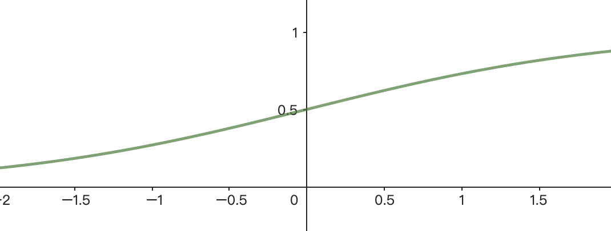

# 逻辑回归及其代码

[TOC]

## 逻辑回归介绍

逻辑回归（Logistic Regression）是一种经典的分类算法，尽管名字中有“回归”二字，但它主要用于解决**二分类问题**，即预测的目标变量是二元的（如0或1、是或否、正类或负类）。逻辑回归通过逻辑函数（Sigmoid函数）将线性回归的输出映射到(0, 1)区间，从而将问题转化为概率预测。

**【逻辑回归模型】**

```math
P(y=1|x)=\frac{1}{1+e^{-\mathbf{ \omega ^{T}x}}} 
```

其中，这是一个sigmoid函数，可以输出(0,1)区间的数值，表示某一组特征值属于某一类的概率，$`\omega`$表示的是模型的参数矩阵，$`x`$表示的是模型的特征值矩阵，而P表示的是模型在给定特征x的条件下，模型属于正类(y=1)的概率；

sigmoid函数的大致图像如下，可以看到它输出(0,1)区间的数值，适合表示概率，通过改变x的系数可以改变图像的“宽度”；



**【模型损失函数】**

逻辑回归的损失函数是对数损失，也被称为**交叉熵损失**，表示为：

```math
L = -\frac{1}{N} \sum_{i=1}^{N} \left[ y_i \log(\hat{p}_i) + (1 - y_i) \log(1 - \hat{p}_i) \right]
```

其中，$`y_{i}`$表示真实标签（0/1），$`\hat{p_{i}} `$表示模型预测样本属于正类的概率，N是样本数量；

该损失函数由似然函数推导而来，似然函数：

```math
L(\omega )=\prod_{i=1}^{N}([p(x_{i})]^{y_{i}}[1-p(x_{i})]^{1-y_{i}}) 
```

要将函数的幂进行处理，并将累乘变为累加，我们需要对函数两边取对数，得到：

```math
L(\omega )=\sum_{i=1}^{N} [y_{i}logp(x_{i})+(1-y_{i})log(1-p(x_{i}))]
```

**求似然函数的最大值即是求损失函数的最小值**，所以给其添加负号，同时防止累加值过大，将其除以N，我们就能得到损失函数：

```math
J(\omega)=-\frac{1}{N}logL(\omega)= -\frac{1}{N} \sum_{i=1}^{N} [y_{i}logp(x_{i})+(1-y_{i})log(1-p(x_{i}))]
```

 

## 梯度下降法求解(纯手打公式🥵给个star支持一下主播)

类似于线性回归中的梯度下降法(可见[线性回归公式推导](./W1_T2_线性回归公式推导.md))，逻辑回归的梯度下降法也是通过求损失函数关于参数$`\omega`$的一阶偏导数寻找下降方向，从而更新模型参数，梯度计算为：

```math
\mathbf{grad} =\frac{\partial J(\omega )}{\partial \omega} =-\frac{1}{N}\sum [\frac{y_{i}}{p(x_{i})}·\frac{\partial p(x_{i})}{\partial \omega}-\frac{1-y_{i}}{1-p(x_{i})}·\frac{\partial p(x_{i})}{\partial \omega }  ] 
```

```math
=-\frac{1}{N} \sum \frac{\partial p(x_{i})}{\partial \omega }·[\frac{y_{i}}{p(x_{i})}-\frac{1-y_{i}}{1-p(x_{i})}]
```

```math
=-\frac{1}{N} \sum [p(x_{i})·(1-p(x_{i}))·x_{i}]·[\frac{y_{i}}{p(x_{i})}-\frac{1-y_{i}}{1-p(x_{i})}]
```

```math
化简得到：\mathbf{grad=\frac{\sum_{i=0}^{N} (p(x_{i})-y_{i})·x_{i}}{N} } 
```

那么通过对参数$`\omega `$进行迭代就能得到：

```math
\omega_{i}^{k+1}= \omega_{i}^{k}-\alpha ·\mathbf{grad} 
```

同样的，其中$`\alpha`$表示的是模型的学习率，k表示的是迭代的次数

## 代码实现

首先导入必要的库，分别用于数据读取、数据处理及图像绘制

```python
import pandas as pd
import numpy as np
from matplotlib import pyplot as plt
```

数据处理，这里我们使用归一化，将数据缩放到[0,1]之间的数值：

```python
def normalize(X):
    """归一化：将数据缩放到 [0, 1] 范围内"""
    X_min = np.min(X, axis=0)  # 每列的最小值
    X_max = np.max(X, axis=0)  # 每列的最大值
    X = (X - X_min) / (X_max - X_min)
    return X
```

根据前面介绍的逻辑回归模型，借助numpy库我们可以得到sigmoid函数：

```python
def sigmoid(x):
    return 1 / (1 + np.exp(-x))
```

基本的代码完成，我们可以开始编写逻辑回归类，对象的属性由**模型输入X、输出y及模型参数w**构成：

```python
class LogisticRegression:
    def __init__(self):
        self.w = None
        self.X = None
        self.y = None
```

将数据的读取和数据集的划分也分装到类中，代码较简单，不再赘述，这里采用的数据集是iris数据集爆改版，数据集共包含4个特征值，2种分类：

```python
    def read_data(self, filename='./data/iris.csv'):
        """读取数据"""
        df = pd.read_csv(filename)
        self.X = df.iloc[:, 1:-1].values
        self.y = df.iloc[:, -1].values

    def divide_data(self):
        """划分数据集：训练集/测试集"""
        indices = np.arange(0, self.X.shape[0])
        np.random.shuffle(indices)

        train_size = int(self.X.shape[0] * 0.8)
        train_indices = indices[:train_size]
        test_indices = indices[train_size:]

        train_X = self.X[train_indices]
        train_y = self.y[train_indices]
        test_X = self.X[test_indices]
        test_y = self.y[test_indices]

        return train_X, train_y, test_X, test_y
```

接下来是关键的w梯度下降求解代码，首先初始化w，根据前面推出的梯度公式，对w进行迭代，在每一轮迭代中，这里同时对损失函数进行计算并存入loss_history中，用于最后绘制损失函数图像(MSE LINE)，有了前面的推导基础，代码的实现也较为简单：

```python
    def train(self, epochs=100, learning_rate=0.01):
        """梯度下降法迭代求解参数w"""
        self.w = np.ones(self.X.shape[1])
        train_X, train_y, _, _ = self.divide_data()
        train_X = normalize(train_X)
        loss_history = []

        for epoch in range(epochs):
            # 计算梯度
            grad = np.mean(
                [((sigmoid(np.dot(self.w.T, train_X[i])) - train_y[i]) * train_X[i]) for i in range(train_X.shape[0])],
                axis=0)
            self.w -= learning_rate * grad

            # 计算损失
            loss = -np.mean([
                (train_y[i] * np.log(sigmoid(np.dot(self.w.T, train_X[i]))) +
                 (1 - train_y[i]) * np.log(1 - sigmoid(np.dot(self.w.T, train_X[i]))))
                for i in range(train_X.shape[0])
            ])
            loss_history.append(loss)

            if (epoch + 1) % 50 == 0:
                print('epoch: {}, loss: {}, w: {}'.format(epoch+1, loss, self.w))

        return loss_history
```

完成训练，我们可以用前面划分出来的测试集，对模型进行准确率评估：

```python
    def evaluate(self):
        """模型评估"""
        accuracy = 0
        _, _, test_X, test_y = self.divide_data()
        for i in range(test_X.shape[0]):
            result = sigmoid(np.dot(self.w.T, test_X[i]))
            result = 0 if result < 0.5 else 1

            if result == test_y[i]:
                accuracy += 1

        accuracy /= test_X.shape[0]
        return accuracy
```

主函数：

```python
if __name__ == '__main__':
    lr = LogisticRegression()
    lr.read_data()
    lr_loss = lr.train(epochs=1000, learning_rate=0.1)

    # 根据准确率对模型进行评估
    acc = lr.evaluate()
    print("Accuracy: {}%".format(acc * 100))

    # 绘制损失函数
    plt.title("MSE LINE")
    plt.plot(lr_loss)
    plt.show()
```

### 实验结果报告

观察运行代码的输出：

```
epoch: 50, loss: 0.520230477198475
epoch: 100, loss: 0.4252965149805779
epoch: 150, loss: 0.35966419103464375
epoch: 200, loss: 0.3115685955385885
epoch: 250, loss: 0.2747885092279347
epoch: 300, loss: 0.24580201199535412
epoch: 350, loss: 0.22242564486841637
epoch: 400, loss: 0.20321559792144867
epoch: 450, loss: 0.18717587435011268
epoch: 500, loss: 0.1735981751098445
epoch: 550, loss: 0.1619664292929578
epoch: 600, loss: 0.15189677901579315
epoch: 650, loss: 0.14309847266680148
epoch: 700, loss: 0.13534767697042743
epoch: 750, loss: 0.1284695373632668
epoch: 800, loss: 0.12232564164193578
epoch: 850, loss: 0.11680510101371802
epoch: 900, loss: 0.11181810013720181
epoch: 950, loss: 0.1072911621315579
epoch: 1000, loss: 0.10316362415867512
Accuracy: 100.0%
```

我们可以发现模型对测试集的所有数据都有极好的预测，最终的准确率为Acc=100%，观察损失图像：


不难发现，损失函数图像是一条肘型光滑曲线，损失递减。


Written by ricckker

2025/3/19 广东·广州